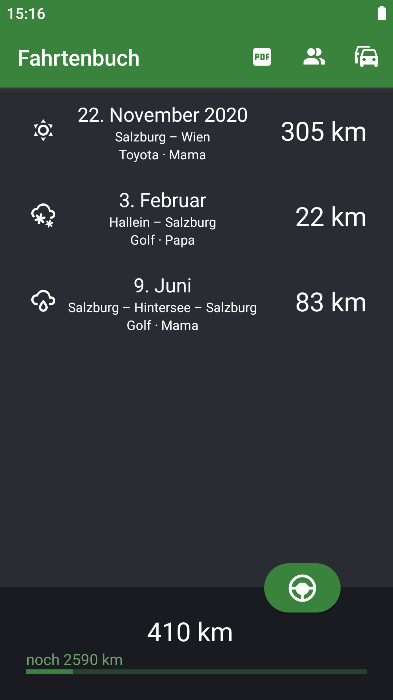
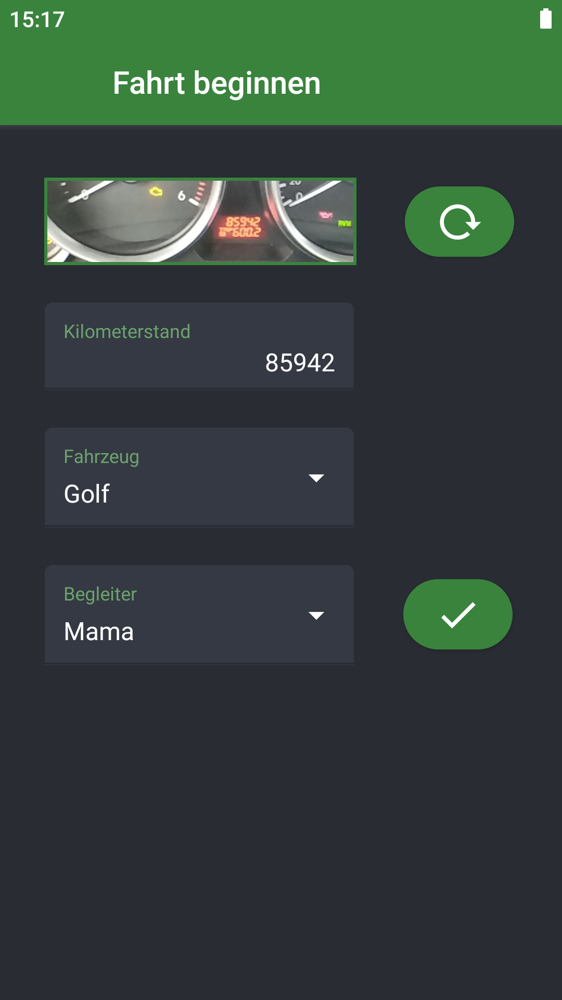
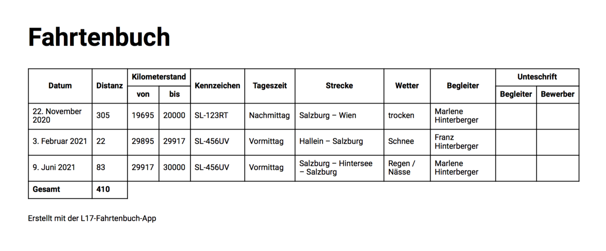

# L17-Fahrtenbuch

## Motivation

The goal of this app is to simplify the process of keeping a driver's logbook for driving students participating in Austria's preliminary driving license program "L17". 

## Showcase

Upon opening the app, a list of previous journeys is shown.

Buttons in the top bar allow to export a pdf report, and to manage tutors and vehicles.

The total driven distance is shown at the bottom, as well as how far the student has to go to the goal of 3000 km.

Clicking on the button to start a journey, a screen with a form opens up.

The driving student can scan the current mileage directly from the car's dashboard to prefill the form.

Based on the mileage, also the correct vehicle is selected.

The procedure for finishing the journey is quite similar.

The driver's logbook can be exported to pdf and shared via email.

## Implementation

The app is written in Javascript and React Native.
I developed it in the context of my bachelor thesis in summer 2021.

Journeys, vehicles and tutors are stored using redux.
Local form data is stored in state and passed down via props.

The dashboard picture is cropped to the displayed frame and OCR-ed using Google's ML Kit (on device).

Libraries used:

* react-navigation
* react-redux
* react-native-async-storage
* redux-persist
* react-native-paper
* react-native-paper-dropdown
* react-native-vector-icons
* react-native-camera
* react-native-photo-manipulator
* react-native-mlkit-ocr
* react-native-html-to-pdf

Focusing on Austria's driving students, the app only has a German version for now.
If you are interested in a translated version or an iOS export, please open an issue.
